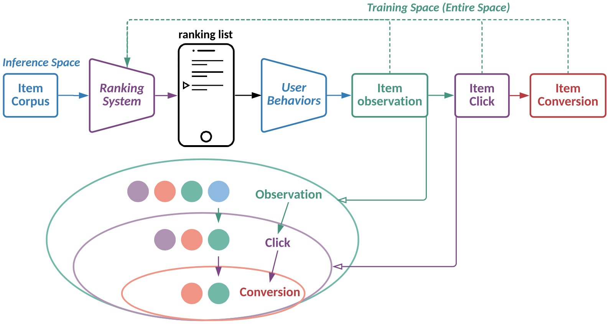

# Hierarchical rEcurrent Ranking On the Entire Space (HEROES)

  
   
   

This includes`tensorflow` and `pytorch` implementations of HEROES model. This is the experiment code in the following work:
 
   

> Multi-Scale User Behavior Network for Entire Space Multi-Task Learning  
Jiarui Jin, Xianyu Chen, Weinan Zhang, Yuanbo Chen, Zaifan Jiang, Zekun Zhu, Zhewen Su, Yong Yu.  
[CIKM 2022](https://jinjiarui.github.io/paper.html)

### Prerequisites
- Python 3.6
- Pytorch 1.8.0
- TensorFlow 1.14.0

### Run
Please use `python model_dataset.py` to run our model and baseline methods, where the model is in [esmm, esmm2, mmoe, dnn, heroes], and the dataset is in [alicpp, criteo].
